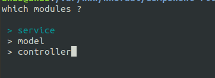

# Component File Generator

[](https://www.npmjs.com/package/component-file-generator)  [](https://travis-ci.org/khofaai/component-file-generator) [](https://www.npmjs.com/package/component-file-generator) [](https://www.npmjs.com/package/component-file-generator)

This package helps me and our team to generate complex components structues with ease

# Installation

you can install it using npm :

```bash
npm i component-file-generator
```

# Setup

## Basic

you need to install `node` on your machine to use this package,

also create a simple file in your app root :
```
└── projectName
    └── ...
    └── generator.js
```

with the following code :
```javascript
const generator = require('component-file-generator');
generator.exec(
  {
    service: {
      root:'./app/services',
      structure: {
        name: "[name]",
        children:[
          {
            type: "file",
            name: "README.md",
            content: "# [name] Service\n description"
          },
          {
            type: "file",
            name: "[name]Service.js",
            content: `import Service from '../Service';\n\nexport default class [name] {\n\t// instruction\n\t}\n}\n`
          },
          {
            type: "file",
            name: "package.json",
            content: "{\n\t\"main\": \"./[name]Service.js\"\n}"
          }
        ]
      }
    }
  },
);
```

for the above example we will get the following folder structure :

```
├─ ...
└─ app
  ├─ services
    ├─ [ComponentNameA]
    │  ├─ [ComponentNameA]Service.js
    │  ├─ README.md
       └─ package.json
```

to Execut it from root project using CLI :

```bash
node generator
```

it will prompt a question : in our case `service name ?`
```bash
service name ?
_
```

## Multiple items

Easy as the first example:


with the following code :
```javascript
const generator = require('component-file-generator');
generator.exec({
	service: {
		root:'./app/services',
		structure: {
			name: "[name]",
			children:[
				...
			]
		}
	},
	model: {
		root:'./app/models',
		structure: {
			name: "[name]",
			children:[
				...
			]
		}
	},
	controller: {
		root:'./app/controllers',
		structure: {
			name: "[name]",
			children:[
				...
			]
		}
	},
	...
});
```

you'll get a prompt with select options:



# Custom Structure

You can add one or multiple custom component types, you pass an `Object` with a `key` that represent component name and `value` with an object with **root** and **structure** to define where and what should generate:
- `root` folder where to generate structure
- `structure` that containe your component file architecture

Example :
```javascript
// in this case our component name is `service`
generator.exec({
	[key]: { // component/module nane
		root:'path/to/folder',
		structure: { ... },
	}
});
```

## Name Modificators

We only implimented two `lowerCase` and `capitalize` for the moment,

you can use them like :
```
...
{
  type: "file",
  name: "[name:lowerCase].md",
  content: "# [name:capitalize] Service\n description"
}
...
```

# Next
- For structure proprety `content` will be able accept path for file templates too
- Write proper documentation

## Changelog 0.5.0
- add name modificators: ['lowerCase', 'capitalize']
- optimize workflow
- update readme.md
